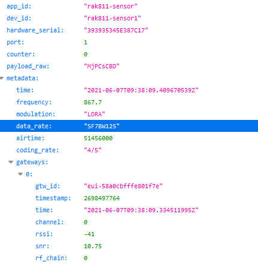

# The Things Network auslesen
Hier sind diverse Scripts abgelegt welche für das Auslesen und Darsellen von Daten aus dem Thongs Network benötigt werden. 

## Inhalt

- [HTML-Website](./html)
- [Auslesen von TTN via MQTT](/01_Read_from_TTN/mqtt)

## MySQL-Datenbank

### Erstellen der Tabelle

Mit dem untenstehenden Befehl kann die benötigte Datenbanktabelle erstellt werden. Darauf sollten natürlich die entsprechenden Berrechtigungen gesetzt werden. 
```SQL
CREATE TABLE `tbl_messages` (
  `messageID` int(11) NOT NULL,
  `app_id` varchar(25) NOT NULL,
  `dev_id` varchar(25) NOT NULL,
  `counter` varchar(25) NOT NULL,
  `payload_raw` varchar(50) NOT NULL,
  `time` varchar(25) NOT NULL,
  `frequency` varchar(25) NOT NULL,
  `enable` tinyint(1) DEFAULT 1,
  `dateTime_created` timestamp NOT NULL DEFAULT current_timestamp() ON UPDATE current_timestamp(),
  `channel` int(11) NOT NULL,
  `airtime` int(11) NOT NULL,
  `coding_rate` varchar(25) NOT NULL,
  `data_rate` varchar(255) NOT NULL,
  `hardware_serial` varchar(255) NOT NULL,
  `modulation` varchar(255) NOT NULL,
  `port` varchar(255) NOT NULL,
  `rf_chain` int(10) NOT NULL,
  `rssi` varchar(255) NOT NULL,
  `snr` varchar(255) NOT NULL,
  `tmstmp` text NOT NULL,
  `topic` varchar(255) NOT NULL
) ENGINE=InnoDB DEFAULT CHARSET=utf8mb4;
```

## HTML
Über eine einfache Website werden die Daten aus der Datenbank ausgelesen und dargestellt. Dabei wird die Ganze Tabelle ausgewählt und der Aktuellste eintrag angezeigt.

```php
$sql = "SELECT * FROM tbl_messages ORDER BY time desc LIMIT 1";
```

Danach werden die entsprechenden Daten angezeigt. Dies wird ganz über eine `foreach` schleife gemacht.
```php
echo "<div class=\"container\">";
foreach ($row as $title => $item) {
      
      echo "<div class=\"box\"><h3>". $title.": </h3><h4>     ". $item."</h4></div>";
    }
```

## Python Script

Über ein Pythonscript wird dem entsprechenden MQTT-Topic gefolgt. 
### Konfig MQTT

Am Anfang des Skriptes müssen drei Parameter definiert werden

```python
topic = "your/mqtt/topic"
mqttuser = "your-user"
mqttpw = "your-password"
ttnurl = "your.ttn.url"
```

### Verarbeiten der Daten
Immer wenn der Sensor neue Daten sendet, werden diese heruntergeladen. Die Daten werden im `JSON` Format zurückgegeben. 
Diese werden dann geparsed in vier Oberthemen sortiert.
- Data
- Metadata
- Gateways

```python
data = json.loads(msg.payload.decode('utf-8'))
meta = data["metadata"]   
gways = meta["gateways"]
```


### MySql Config

Etwas weiter unten im Skript muss noch der MySql Server konfiguriert werden.

```python
mydb = mysql.connector.connect(
    host="localhost",
    user="youruser",
    password="",
    database="your-database")
```
Ist all dies korrekt konfiguriert werden nun alle Sensordaten in die Konfigurierte Datenbank geschrieben. 

## Installation

Alle benötigten Module könne über auch über das `requirements.txt` file installiert werden.
```
pip3 install requirements.txt
```
